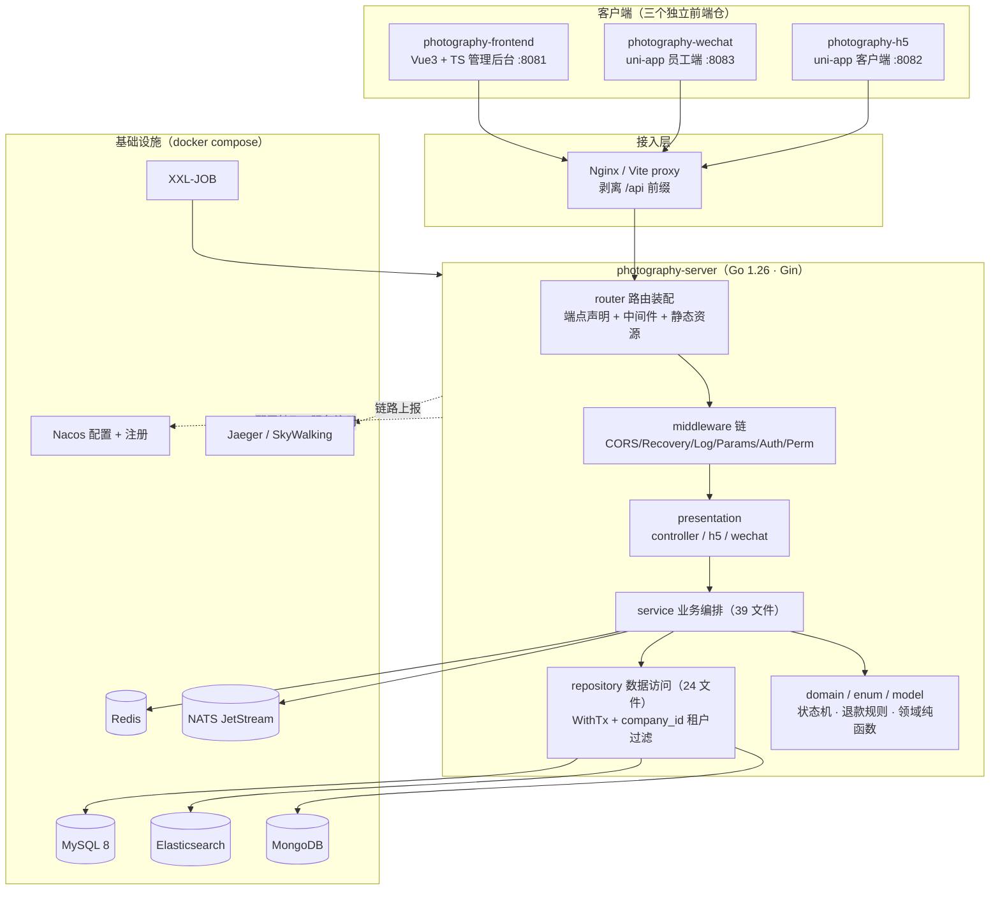
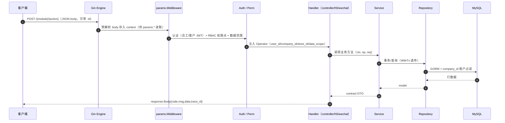
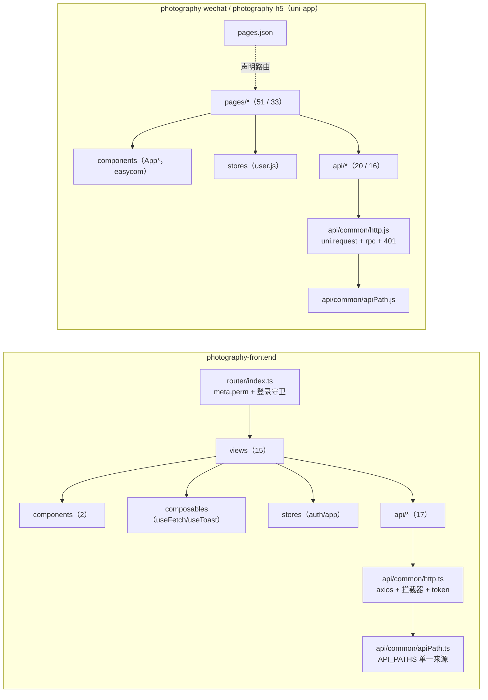
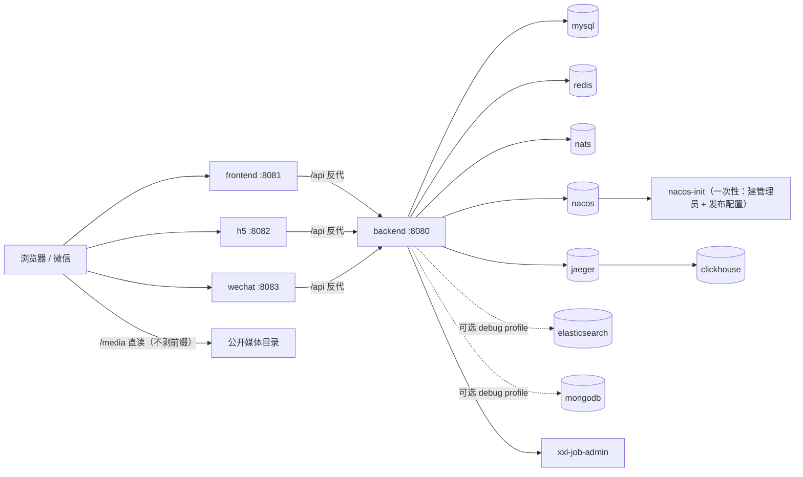
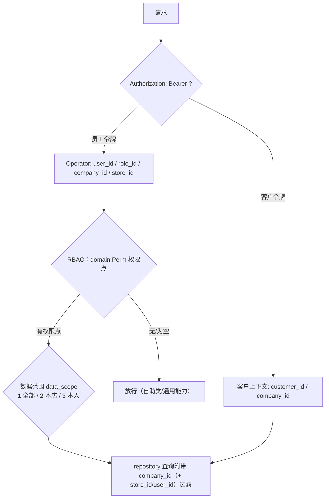

# 系统架构图（四仓）

> 图用 Mermaid 表达，GitHub/GitLab/VS Code 可直接渲染；纯文本阅读也能看懂。

## 一、总体架构

## 二、端与挂载点

| 端 | 前缀 | 控制器 | 鉴权 |
| --- | --- | --- | --- |
| PC 管理后台 | 无 | `presentation/controller` | `Auth`（员工 JWT）+ `Perm`（RBAC 权限点） |
| 小程序管理后台 | `/miniapp` | 同 PC，同一 Handler | 同 PC |
| 客户 H5 | `/h5` | `presentation/h5` | 公开组免鉴权 + `CustomerAuth` 组 |
| 微信客户区 | `/wechat` | 同 H5，同一 Handler | 同 H5 |
| 员工小程序 | `/wechat/staff` | `presentation/wechat`（独有）+ 复用 PC handler | `StaffAuth` + `Perm` |

路由是**声明式**的：`presentation/routes`（有哪些路由）→ `presentation/endpoint`（怎么挂）→ `router/endpoints.go`（每个端暴露哪些）；同 Path 跨端必须是同一函数指针（护栏测试）。

## 三、后端请求链路

关键约定：

- 业务接口一律 `POST` + JSON body；`create/update` 主键在 body，`detail/status/delete` 主键在路径。
- 统一响应 `Body{code,msg,data,trace_id}`；列表 `Page{list,total,page,page_size}`。
- 错误经 `errs.BizError` 归一；5xx 抓构造点堆栈并写 Jaeger。
- 依赖单向：`presentation -> service -> repository -> model/domain`；业务层不 `import infrastructure`，只依赖 `app.App`。

## 四、前端各仓内部分层

## 五、部署拓扑（docker-compose，backend 仓统一编排）

> 端口与依赖关系以 `photography-server/docker-compose.yml` 为准；`debug` profile 才启动 ES / MongoDB。

## 六、鉴权与多租户

- 多租户：所有业务表含 `company_id`，`repository` 统一带租户过滤；客户区用 slug 反查 `company_id`，不接受客户端直传。
- 权限点：`domain/perm.go` 定义，`sys_role_permission` 存储；端上按 `Perm` 中间件挂载。