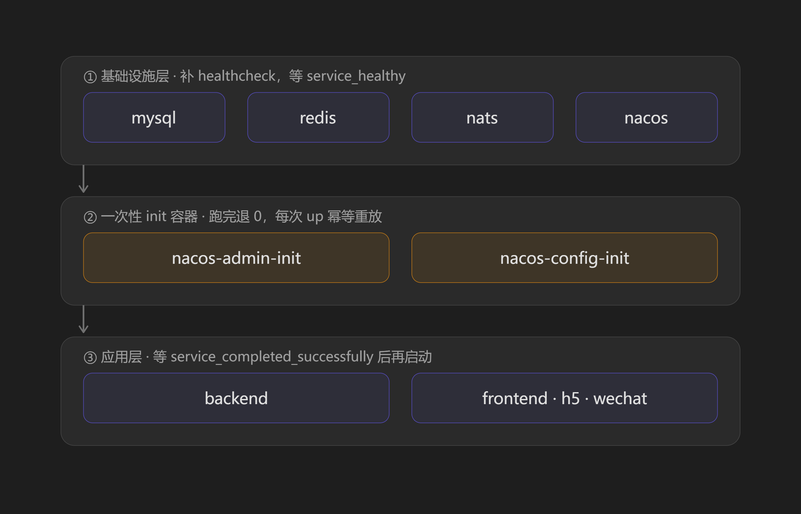
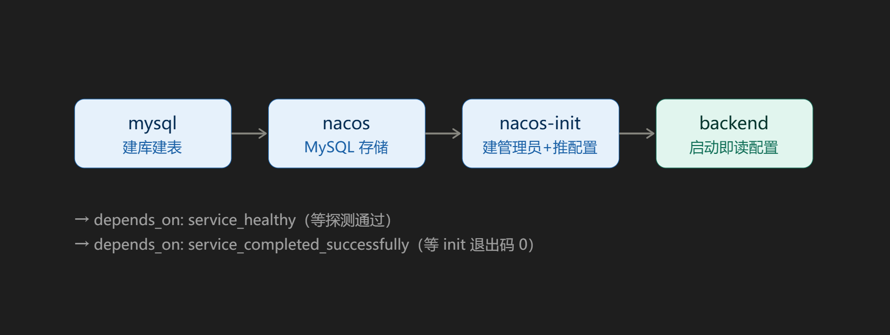

# 部署总览

> 本文是部署的**入口文档**。
> 首次部署的分步操作 → [`docker-compose部署流程.md`](docker-compose部署流程.md)；
> 架构、网络隔离与构建链 → [`容器化部署方案.md`](容器化部署方案.md)。

---

## 一、一条命令启动

```bash
cd <部署目录>              # 内含 docker-compose.yml、.env、volume/ 与四个平级仓
docker compose up -d
```

**首次部署与日常启动是同一条命令**，不再需要"先起基础设施 → 手动初始化 → 再起应用"的分阶段操作。

```bash
docker compose ps -a             # 看全部容器；nacos-init 显示 Exit 0 = 初始化成功
docker compose logs nacos-init   # 初始化做了什么（登录 / 发布 / 跳过）
docker compose up -d --wait      # 想等所有 healthcheck 通过再返回（Compose v2）
```

`photography-server/` 内的 Makefile 简写：

| 命令 | 等价操作 |
|---|---|
| `make docker-up` | `docker compose up -d` |
| `make docker-up-wait` | `docker compose up -d --wait` |
| `make docker-ps` | `docker compose ps -a`（带已退出的一次性容器） |
| `make docker-logs-init` | `docker compose logs nacos-init` |
| `make docker-logs-backend` | `docker compose logs -f backend` |

---

## 二、为什么以前不能一键启动



问题**不在"启动顺序"**，而在三种性质完全不同的依赖被混在一起看待：

| 类型 | 含义 | 例子 | compose 能否表达 |
|---|---|---|---|
| ① 进程级 | 容器启动的先后 | redis 先于 backend | ✅ `depends_on`（裸写） |
| ② 就绪级 | 服务真的能收请求 | mysql 能 ping 通 | ✅ `healthcheck` + `condition: service_healthy` |
| ③ **数据级** | **数据已经存在** | **Nacos 里有 data_id、MySQL 里有表、Nacos 里有管理员** | ❌ **compose 无权表达** |

前两类 compose 原生支持（原来我们只做了一半：`nacos` 连 `healthcheck` 都没有，backend 只等 `service_started`，
而该条件只保证"容器已启动"、不等服务可用）。**第三类才是"没法一键"的真因** ——
它描述的是**数据状态**而非进程状态，`depends_on` 无论怎么写都等不到。

> 上图为分层设计示意。实现时已把"初始化管理员"与"发布配置"两步**合并进同一个 `nacos-init` 容器**
> （一次执行内顺序完成），因此实际只有**一个** init 容器。

解决办法是给第③类也找一条**编排可等待**的路径：

- 有进程可等的（Nacos 管理员 + 配置发布）→ **一次性 init 容器**，`condition: service_completed_successfully`
  等它**退出码 0**；
- 没有进程可等的（MySQL 库表）→ **MySQL 官方镜像自带的 `/docker-entrypoint-initdb.d/`** 机制
  （只在数据卷为空时执行，天然幂等）。

---

## 三、改造后的启动顺序

| 阶段 | 服务 | 等待条件 |
|---|---|---|
| ① 基础设施 | `mysql` | 无依赖；**首启执行 initdb 脚本**，建 `photography` / `nacos` / `xxl_job` 三个库与全部表 |
|  | `redis`、`nats` | 无依赖（探针就绪即 healthy） |
| ② 元数据服务 | `nacos` | `mysql: service_healthy` —— 它的库表正是①建的 |
|  | `xxl-job-admin` | `mysql: service_healthy` |
| ③ **数据初始化（一次性）** | `nacos-init` | `nacos: service_healthy`；**退出码 0** 才算完成 |
| ④ 应用 | `backend` | `nacos-init: service_completed_successfully` + `mysql`/`redis`/`nats`/`nacos` 均 `service_healthy` |
| ⑤ 前端站点 | `frontend`、`h5`、`wechat` | `backend` 已启动 |
| 可选 | `skywalking-*`、`jaeger`、`clickhouse` | 各自探针；`elasticsearch`/`mongo` 在 `debug` profile，默认不起 |

对应关系：

```
mysql(建库表) ─┬─→ nacos(就绪) ─→ nacos-init(退 0) ─→ backend ─→ frontend / h5 / wechat
               └─→ xxl-job-admin                     ↑
redis ───────────────────────────────────────────────┤
nats ────────────────────────────────────────────────┘
```

---

## 四、三个"数据级依赖"各自怎么解决

### 4.1 MySQL 库表 —— 用镜像原生机制，不写新脚本

compose 的 `mysql.volumes` 挂了四个脚本到 `/docker-entrypoint-initdb.d/`：

| 容器内文件 | 来源 | 内容 |
|---|---|---|
| `01-nacos-schema.sql` | `docs/sql/initdb/01-nacos-schema.sql` | Nacos 3.2.4 官方 schema（13 张表）+ 建 `nacos` 库 |
| `02-xxl-job-tables.sql` | `docs/sql/initdb/02-xxl-job-tables.sql` | XXL-JOB 3.4.2 官方建表脚本（自带建 `xxl_job` 库） |
| `03-business-ddl.sql` | `docs/sql/ddl.sql` | 业务库表（自带 `CREATE DATABASE photography` + `USE`） |
| `04-business-dml.sql` | `docs/sql/dml.sql` | 业务初始数据 |

- **只在数据卷为空时执行**（首次初始化），已有数据的库一律跳过 → 对现网零风险。
- 顺序由文件名前缀决定，`01` → `04`。
- ⚠️ `01` 与 `03` 里的 `CREATE DATABASE ... ;` 和 `USE ...;` **必须各自保持单行**：
  SQL 格式化器一旦把 `USE` 与库名拆成两行，整库初始化会直接失败（同 `docs/sql/README.md` 对 `ddl.sql` 的警告）。

### 4.2 Nacos 管理员 —— `nacos-init` 调用 v3 接口

Nacos 3.x 起用户表默认为空（不再预置 `nacos/nacos`），未初始化时 backend 登录会报 401 `User not found` → fail-fast。

`nacos-init` 的顺序是**先试登录**（能登录就说明管理员已存在 → 跳过），失败才调用：

```bash
POST /nacos/v3/auth/user/admin   -d 'password=<APP_NACOS_PASSWORD>'
# 已存在管理员时返回 {"code":409,"message":"have admin user cannot use it."} —— 视为成功（幂等）
```

⚠️ 它**不会改写已存在管理员的密码**。所以 `.env` 的 `APP_NACOS_PASSWORD` 必须与 Nacos 上实际的
管理员密码一致，否则容器会以明确的错误信息退出（而不是把密码改掉）。

### 4.3 业务配置发布 —— 同一个容器内顺带完成

登录拿到 token 后，比对远端 `data_id`（默认 `photography-server-<APP_PROFILE>.yaml`）与本地模板：

| 情况 | 行为 |
|---|---|
| 远端不存在 | 推送本地模板（**首次部署**） |
| 远端与模板一致 | 跳过推送 |
| 远端不一致（有人在控制台改过） | **保留远端**、打印警告、**退出 0** —— 否则 backend 会永远起不来 |

要让本地模板强行覆盖远端：`.env` 设 `NACOS_INIT_FORCE_PUSH=true`。差异对照在本机跑
`./scripts/nacos_publish.sh <profile> --diff`。

---

## 五、首次部署前置条件

| # | 事项 | 说明 |
|---|---|---|
| 1 | **镜像已在别处构建并推送** | 2 核 2G 机器上跑 `docker compose build` 必 OOM（Go 编译 + 3 个前端 vite 构建，峰值 4G+） |
| 2 | `.env` 按 `.env.example` 填好 | 尤其 `MYSQL_ROOT_PASSWORD`、`APP_NACOS_PASSWORD`、`APP_CONFIG_SECRET`（KEK） |
| 3 | 挂载模板文件就位 | `volume/nats/conf/nats.conf`、`volume/jaeger/config.yaml`、`volume/horizon/horizon.yaml` —— 缺文件时 Docker 会**自动建成目录**，容器内报 `is a directory` |
| 4 | **部署目录的 `photography-server/` 与 compose 版本配套** | 新 compose 直接挂载仓库内文件：`scripts/nacos_init.sh`（`nacos-init` 的执行体）与 `docs/sql/initdb/01-nacos-schema.sql`、`02-xxl-job-tables.sql`（首启建库表）。**部署副本没同步这些文件时，Docker 会把缺失的【文件源】建成【目录】**——症状是 mysql 初始化静默跳过、`nacos-init` 报 `is a directory`。同步步骤见 `docker-compose部署流程.md` 第 0 步 |
| 5 | 四个仓平级放在部署目录下 | compose 的 `context` 相对 compose 文件解析（见 `容器化部署方案.md` 第四节） |
| 6 | 端口未被占用 | 8080-8083、3306、6379、4222/8222、8848/9848/8850、9100、9000/8123、4317/4318/16686、11800/12800/17128、17912/17913、9080 |

---

## 六、启动后的验证清单

| 检查 | 命令 | 期望 |
|---|---|---|
| 所有容器状态 | `docker compose ps -a` | 常驻服务 `Up (healthy)`；`nacos-init` 为 `Exited (0)` |
| 初始化动作 | `docker compose logs nacos-init` | 出现"登录成功" + "配置发布成功"或"跳过推送" |
| 三个库是否建好 | `docker exec -it photography-mysql mysql -uroot -p -e "show databases;"` | 有 `photography`、`nacos`、`xxl_job` |
| Nacos 库表 | `docker exec -it photography-mysql mysql -uroot -p -e "select count(*) from nacos.config_info;"` | 命令可执行（表存在） |
| 配置是否已发布 | `./scripts/nacos_publish.sh <profile> --diff` | 提示"本地模板与远端完全一致" |
| 后端日志 | `docker compose logs -f backend` | `ping database ok` → `photography-server listening` |
| 站点 | 浏览器打开 `:8081` / `:8082` / `:8083` | 页面正常、接口返回真实数据 |

---

## 七、常见问题

**Q：`nacos-init` 反复重启 / backend 起不来？**
先看 `docker compose logs nacos-init`：
- 报"登录失败"→ `.env` 的 `APP_NACOS_PASSWORD` 与 Nacos 上实际管理员密码不一致；
- 报"配置模板不存在"→ `NACOS_CONFIG_DIR` 挂载没生效，或 `config/nacos/` 下没有对应 `APP_PROFILE` 的模板；
- 报"健康端点探测超时"→ Nacos 未真正就绪，先 `docker compose logs nacos` 看是不是连不上 MySQL。

**Q：我只想重启 backend，但不想每次都被重放初始化？**
`.env` 设 `NACOS_INIT_ENABLE=false` —— init 容器会秒退且退出码仍为 0，不阻塞 backend。

**Q：改了 `config/nacos/*.yaml` 后要做什么？**
本机 `./scripts/nacos_publish.sh <profile>` 推送，或直接 `docker compose up -d`（会重放 `nacos-init`）。
⚠️ 只改仓库文件不推送是**不生效**的 —— backend 读的是 Nacos 远端。

**Q：`nacos` 容器重建后配置还在吗？**
在。已切到 MySQL 存储（原内嵌 Derby 落在容器可写层，recreate 即丢）。

**Q：`nacos-init` 报 `bash: /init.sh: is a directory`？**
部署目录的 `photography-server/` 里没有 `scripts/nacos_init.sh`（bind 源文件缺失时 Docker 会把它建成空目录）。
把仓库更新到与 compose 同一版本即可，见前置条件第 4 条。

**Q：mysql 起来了，但 `nacos` 库不存在、`nacos` 一直重启？**
同上：`docs/sql/initdb/*.sql` 没有同步到部署目录，initdb 挂载点是空目录（甚至不是 `*.sql` 文件，
mysql 会直接跳过）。另外注意 **initdb 只在数据卷为空时执行** —— 若 `volume/mysql/data` 已有数据，
需手动补跑：`docker exec -i photography-mysql mysql -uroot -p < docs/sql/initdb/01-nacos-schema.sql`。

**Q：`xxl-job-admin` 显示 unhealthy 会影响启动吗？**
不会。backend 对它的等待条件是 `service_started`（故意不升级为 healthy），因为该镜像内可用的探活工具不确定。
它未就绪时 backend 会跳过任务注册（仅打 warn），必要时重启一次 backend 即可。

**Q：`nats` 探针一直失败？**
检查 `volume/nats/conf/nats.conf` 里是否有 `http_port: 8222`（模板见 `config/nats.example.conf`）——
监控端口不开，`/healthz` 就永远取不到。
